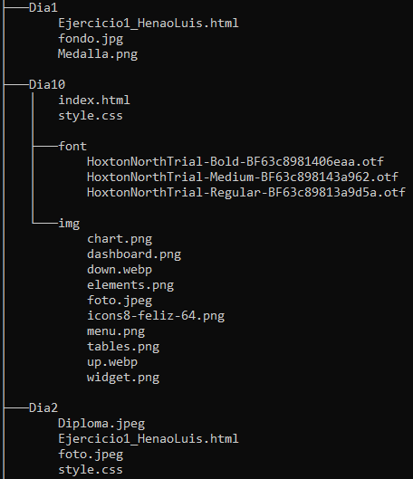
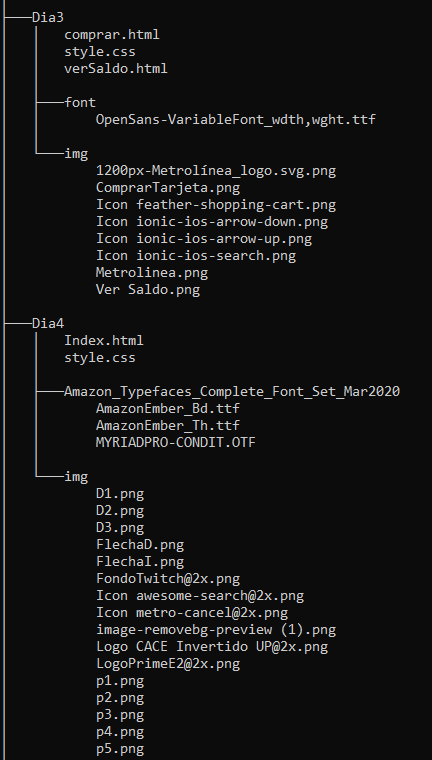
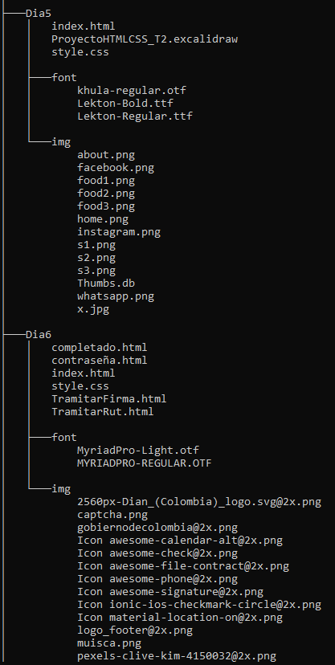
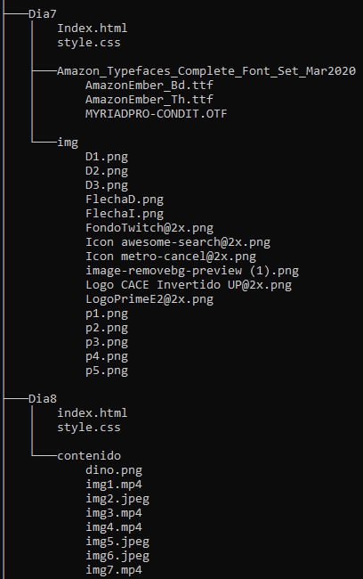
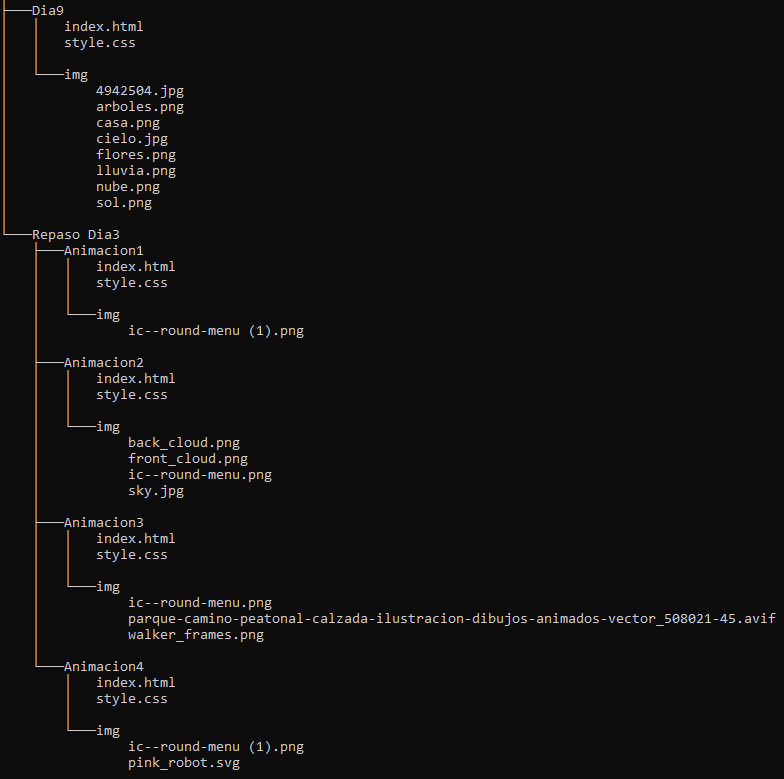

# HTML & CSS 

Proyectos que muestran mi avance en el aprendizaje de HTML y CSS, en estos proyectos hay prototipos de páginas web los cuales no son funcionales y solo son proyectos de front end.

## Estructura










## Carpetas y contenido

|Carpeta|Contenido|
|--|--|
|Dia1|Página web con de proyecto de vida, esta página solo contiene 3 secciones las cuales son quien soy, fortalezas y debilidades|
|Dia2|Página de hoja de vida, es una página la cual contiene foto, información personal, diploma, información académica, habilidades, debilidades y proyectos personales|
|Dia3|Simulación de página de metro línea, esta página contiene 2 secciones las cuales son comprar tarjeta y ver saldo las cuales se pueden desplazar a través de los links del header|
|Dia4|Simulación de página de prime entertainment es una one page, en esta página se puede obtener información sobre Amazon prime y puede registrarse|
|Dia5|Simulación de página de comidas, tiene formato one page, en la cual hay información de los tipos de comidas, servicios y contacto. Esta página cuenta con un header el cual contiene links para desplazarse entre las distintas partes de la página.|
|Dia6|Simulación de página de la DIAN en la cual puedes consultar ingresando tu número de documento y fecha de expedición, también podrás tramitar firma electrónica y tramitar RUT. El proyecto consta de 5 páginas a las cuales se puede ir a través de los link|
|Dia7|Simulación de página de prime entertainment es una one page, en esta página se puede obtener información sobre Amazon prime y puede registrarse. La diferencia entre esta simulación y la del día 4 es que esta tiene medidas relativas, por lo cual se podría decir que es responsive.|
|Dia8|Esta es una página simple en la cual se aprendió el uso de grid y es una página la cual está dividida por grid y contiene GIF e imágenes. Esta página también contiene medidas relativas, por lo que se puede decir que también es responsive.|
|Dia9|Esta es una página en la cual solo hay una animación en la que hay una casa y un jardín, hay un conteo, llega una nube de lluvia, riega el jardín y en el lugar donde llovio nace una flor, en esta página se usaron medidas relativas por lo cual también se podría decir que es responsive|
|Dia10|Pagina Adminsite es una simulacion de pagina de segimiento de Dashboard. Esta pagina contiene un menu hamburguesa en la parte izquierda la cual abre y cierra mostrando distintas opciones. En esta pagina se uso media queries y se muestra un modelo distinto de la pagina al momento de mostrarse en celular y esta pagina es un 90% responsive|
|Repaso_Dia3|Aca hay 3 paginas distintas las cuales consisten solo de animaciones las cuales tienen un menu hamburguesa poe el cual se pueden desplazar entre las diferentes paginas con animaciones|   

## Instalación y Uso
- Para ello debes clonar el directorio del siguiente link de git hub https://github.com/Luis-Orlando-Henao-Bermon/HTML---TRABAJO-EXTRA

- Abre la terminal de git bash y allí escribe el siguiente comando:     

``` bash 
git clone https://github.com/Luis-Orlando-Henao-Bermon/HTML---TRABAJO-EXTRA
```
- Debes tener la siguiente extencion en visual studio code:


- Ahora hay que abrir el archivo *index.html* del proyecto que quieras ver y dar clic derecho en cualquier linea de codigo del archivo y dar clic en la opcion: *open with live server*


## Créditos

Desarrollado por Luis Orlando Henao Bermon C.C.*1093904929*